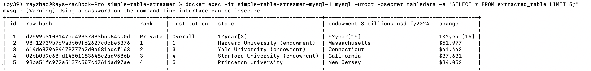

# Take Home Task


## Files:

```
producer.go       			← fetch URL, parse table, infer schema, publish to Kafka
consumer.go       			← read from Kafka, create MySQL table, batch insert rows
docker-compose.yml 			← Kafka + MySQL
.env							      ← all config (copy to .env)
```


## How to run

### 1. Start Kafka + MySQL
```bash
Open the Docker Desktop
```
### 2. Download dependencies
```bash
go mod tidy
```

### 3. Run the consumer (Terminal 1)
```bash
go run consumer.go
```
### 4. Run the producer (Terminal 2)
```bash
go run producer.go
```
### 5. Check the data
```bash
docker exec -it simple-table-streamer-mysql-1 mysql 
						-uroot -psecret tabledata 
						-e "SELECT * FROM extracted_table LIMIT 5;"
```



